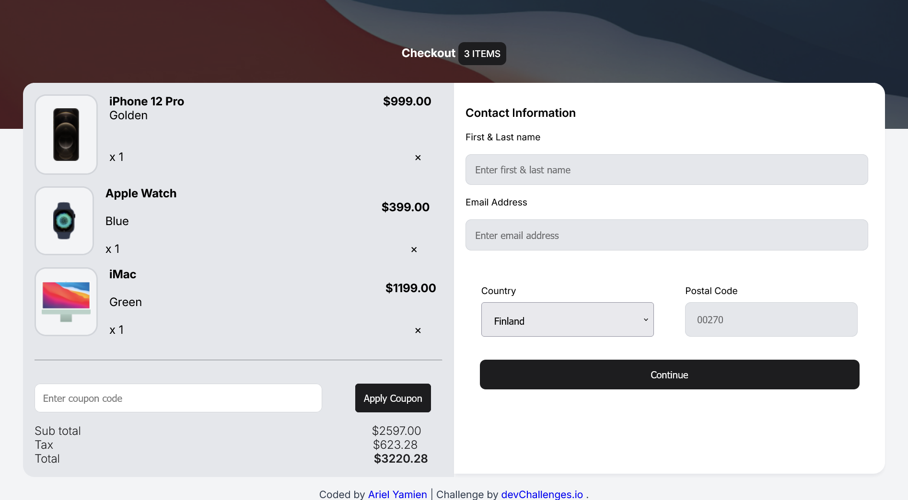

<!-- Please update value in the {}  -->

<h1 align="center">Ariel Yamien | devChallenges</h1>

   Solution for a challenge <a href="https://devchallenges.io/challenge/apple-shop-checkout-page-challenge" target="_blank">Device Shop Checkout</a> from <a href="http://devchallenges.io" target="_blank">devChallenges.io</a>.

  <h3>
    <a href="https://github.com/ariel172/device-shop-checkout-master}">
      Demo
    </a>
     | 
    <a href="https://device-shop-checkout-master-alpha.vercel.app/">
      Solution
    </a>
     | 
    <a href="https://devchallenges.io/challenge/apple-shop-checkout-page-challenge">
      Challenge
    </a>
  </h3>

<!-- TABLE OF CONTENTS -->

## Table of Contents

- [Overview](#overview)
- [Author](#author)
<!-- OVERVIEW -->

## Overview

## Author

- Website [Vercel](https://{https://device-shop-checkout-master-alpha.vercel.app/})
- GitHub [@ariel172](https://{github.com/ariel172})
